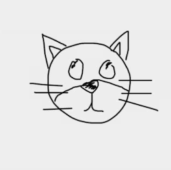
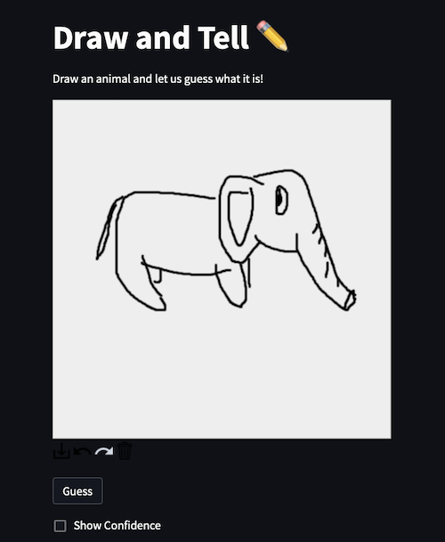
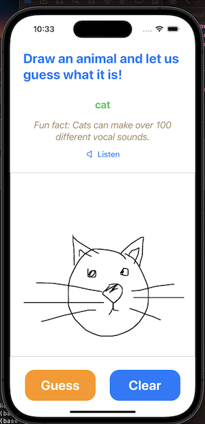
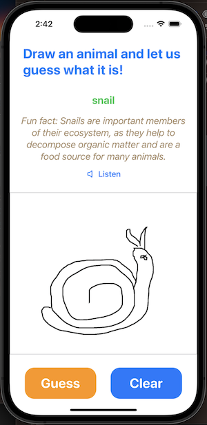

# Draw and Tell
An educational application that recognizes an animal depicted in a doodle and shares a fun fact about it!



## Background
Podcasts are a great way to stay informed, become educated on a variety of topics, or enjoy entertaining content. With millions of podcasts in the Apple podcast store, there are an overwheling number of podcasts to choose from, and finding the right content can be challenging. Our project employs three types of models to recommend content: a hybrid system, a content-based filtering system, and a non-ML approach in TF-IDF term seach. 

## Installation instructions

To run the code in the repository, first install the required packages using:

```bash
pip install -r requirements.txt
```

## Dataset
The doodle data originated from Google's [Quick, Draw! activity](https://quickdraw.withgoogle.com/data). The dataset can be downloaded by following the instructions on their [GitHub page](https://github.com/googlecreativelab/quickdraw-dataset). Alternatively, it is available on [Kaggle](https://www.kaggle.com/competitions/quickdraw-doodle-recognition/data) as well. To download the dataset from Kaggle, run the following script. Just make sure to have your Kaggle API credential present in a JSON file in your home directory `~/.kaggle/kaggle.json`:
```bash
python download_data.py
```

The Quick, Draw! dataset is a gigantic collection of 50 million doodles across 345 categories, contributed by users all over the world. Each record consists of a unique identifier, the word drawn, whether the drawing was recognized, timestamp the drawing was made, country where the user resided in, and an array representing the vector drawing. For the purpose of this project, only the word and the drawing fields are needed. In addition, there's a simplified dataset where the following steps were applied:
align drawing to the top-left corner, to have minimum values of 0, uniformly scale the drawing to have a maximum value of 255, and resample all strokes with a 1 pixel spacing. The simplified version of the data is faster to download and easier to consume. Hence, it was used by this project.

The dataset was further narrowed to consist of only animals and not other objects. The complete list of **51** animals could be found in `scripts/animal_classes.txt`. Please note that several mythical or non-existent animal classes were included, such as `teddy_bear`, `dragon`, `mermaid`.

Sample doodle images:


To gather fun facts about animals, [Wikipedia](https://www.wikipedia.org) was used. The Wikipedia Python API was used to obtain the URLs of pages corresponding to the 51 animal classes. Prompts were then sent to ChatGPT with the URLs as context to request it to provide 10 interesting facts about each animal. All fun facts were subjected to post-processing such as removal of extra punctuations and white spaces, and were manually checked for propriety. The data was stored in a Python dictionary with the animal name as the key and their corresponding list of facts as the value. This dictionary was pickled and saved in `data/animal_facts/animal_facts_dict.pkl`. To gather and process the data again, you may execute the following script:
```bash
python download_animal_facts.py
```

## Non-Deep Learning approach: 
A small subset of the dataset was used for exploring the non-deep learning approach of doodle classification. Specifically 51,000 train images and 10,200 test images were selected for training a non-DL model. In addition, the typical ImageNet model input image size of 224x224 would result in a high-dimensional feature space. Hence, a decision was made to resize the input images to 64x64 for training non-DL models.

The first non-DL model was the Scikit-Learn Random Forest Classifier. Default parameters were used when instantiating the model. After fitting the training data to the model and passing the test data to it, a test accuracy of **18.15%** was observed.

To run the random forest model locally, execute the script:
```bash
python scripts/train_randomforest.py
```

The second non-DL model was the Scikit-Learn Support Vector Classifier. Likewise, default parameters were used when instantiating the model. After fitting the training data to the model and passing the test data to it, a test accuracy of **30.6%** was observed.

To run the support vector machine model locally, execute the script:
```bash
python scripts/train_svm.py
```

It is worth noting that the training the SVM model took a very long time. If the original dataset or the original image resolution was used, it is likely that the training and evaluation time would increase exponentially.

## Deep Learning approach:
The deep learning approach uses neural networks for doodle classification. Specifcally, EfficientNet models were used to reap the following benefits:
- Mobile-size architecture
- Compound scaling - better performance
- Significant reduction in #FLOPS and model size

22500 and 7500 samples of each animal class were obtained from the dataset as train and test set respectively. Collectively, the concatenated train and test datasets consisted of 1,147,500 and 382,500 samples each. The following TorchVision transformations were applied on the train set: Rotation Horizontal Flip, Rotation Vertical Flip,  Random Rotation, and normalization by a mean of 0.5 and standard deviation of 0.5. Only the final transformation was applied on the test set. Other random transformations were not performed as they were deemed unsuitable for the dataset. The images were all resized to 224x224 to fit the input image size of EfficientNet. A batch size of 256 was chosen for the dataloaders.

EfficientNet B0 to B3 models were evaluated and transfer learning was done on them. Specifically, the default pre-trained weights of these models were loaded and were made trainable. The input layer has been modified to accept single channel images as all doodles only have 1 channel. The final fully-connected layer was swapped out for a similar one that outputs the probabilities of 51 classes. Cross Entropy was the loss function defined for the models. And the ADAM optimizer was used with a learning rate of 0.0001. 

The models were initially trained for 15 epochs but terminated prematurely after 7 epochs due to early stopping. The early stopping mechanism is triggered if validation loss (after adjusting by a specified delta) has not improved for 3 consecutive epochs. The weights of the best-performing model was saved regularly.

Train and Test Loss over Epochs:


Train and Test Accuracy over Epochs:


EfficientNet B0 to B3 were evaluated and among them, the B3 model performed the best. It achieved an accuracy of **85.37%**, and a top-3 accuracy of **94.99%**! 

A confusion matrix of the test set was plotted and the classes that were misclassified the most were `bear`, `tiger`, and `dog`. The confusion matrix chart could be found at `plots/confusion_matrix.png` and `plots/confusion_matrix_noannotations.png`.

To run the model locally, execute the script:
```bash
python scripts/train_neuralnetwork.py
```

To run the model locally to obtain top-k accuracy, run the following script:
```bash
python scripts/train_neuralnetwork_topk.py
```
The default value of `K` is `3`. You may edit the value of the constant `_TOP_K` in the script if desired.

To obtain the  confusion matrix, run the following script:
```bash
python scripts/plot_confusion_matrix.py
```

To see class activation maps of an image, run the notebook `notebooks/Class_Activation_Maps.ipynb`.

## Deployment
Two forms of deployment were attempted: cloud and mobile. The cloud deployed application loads the trained PyTorch model and performs inference on the fly. The mobile application consists of a CoreML model that was converted from the trained PyTorch model. The machine learning model on the mobile application is an edge model that does not require data transmission over cellular or WiFi networks to perform an inference.

### Cloud
A Streamlit web application was deployed on Azure to demonstrate the doodle classifier. To deploy the web application:

1. Provision a virtual machine on Azure cloud environment.

2. Access the machine via SSH:
```bash
ssh -i <key.pem> azureuser@<IP address>
```

3. Download Miniconda installer:
```bash
curl https://repo.anaconda.com/miniconda/Miniconda3-py39_23.3.1-0-Linux-x86_64.sh -o Miniconda_installer.sh
```

4. Install Miniconda:
```bash
bash Miniconda_installer.sh
```

5. Create a new Conda environment:
```bash
conda create -n aipi540_fp_streamlit python=3.9 -y
```

6. Clone the git repository:
```bash
git clone https://github.com/textomatic/draw-and-tell.git
```

7. Change to the Streamlit directory:
```bash
cd draw-and-tell/app/streamlit
```

8. Install required packages:
```bash
pip install -r app/streamlit/requirements.txt
```

9. Launch Streamlit process:
```bash
streamlit run app/streamlit/home.py
```

### Mobile (iOS)
An iOS application was created to showcase the doodle classifier and its associated educational benefits in a mobile environment. The mobile app was developed in Xcode and deployed on my personal mobile phone using a temporary, personal provisioning profile. It is possible to publish the app in the AppStore by registering for an Apple developer account and following the formal procedure to submit a app review request.

## Demo

### Cloud
Check the `Show Confidence` box to display the top-3 guesses and their corresponding confidence scores.

You can listen to the audio of a random fun fact about the animal as well.

Screenshot of the web app:


The demo app is hosted on an Azure Virtual Machine. [](http://20.119.56.82:8501) to try out Draw and Tell.

### Mobile (iOS)
When the `Guess` button is pressed, the doodle is automatically saved to the Photos album of the user. The app will request for permission the first time it is used.

You can listen to the audio of a random fun fact about the animal as well.

Screenshots of the iOS app:





## Repository Structure
```
.gitignore
README.md
app
   |-- ios
   |   |-- DrawAndTell
   |   |   |-- DrawAndTell.xcodeproj
   |   |   |   |-- project.pbxproj
   |   |   |   |-- project.xcworkspace
   |   |   |   |   |-- contents.xcworkspacedata
   |   |   |   |   |-- xcshareddata
   |   |   |   |   |   |-- IDEWorkspaceChecks.plist
   |   |   |   |-- xcuserdata
   |   |   |   |   |-- shen.xcuserdatad
   |   |   |   |   |   |-- xcschemes
   |   |   |   |   |   |   |-- xcschememanagement.plist
   |   |   |-- DrawAndTell
   |   |   |   |-- Assets.xcassets
   |   |   |   |   |-- AccentColor.colorset
   |   |   |   |   |   |-- Contents.json
   |   |   |   |   |-- AppIcon.appiconset
   |   |   |   |   |   |-- Contents.json
   |   |   |   |   |   |-- drawandtell_icon_1.png
   |   |   |   |   |-- Contents.json
   |   |   |   |-- ContentView.swift
   |   |   |   |-- DrawAndTellApp.swift
   |   |   |   |-- Extensions
   |   |   |   |   |-- UIImage+Extension.swift
   |   |   |   |-- Models
   |   |   |   |   |-- Line.swift
   |   |   |   |-- Preview Content
   |   |   |   |   |-- Preview Assets.xcassets
   |   |   |   |   |   |-- Contents.json
   |   |   |   |-- Services
   |   |   |   |   |-- DoodleRecognitionService.swift
   |   |   |   |   |-- MLModels
   |   |   |   |   |   |-- drawandtell_v1.mlmodel
   |   |   |   |-- ViewModels
   |   |   |   |   |-- DoodleRecognitionViewModel.swift
   |   |   |   |-- Views
   |   |   |   |   |-- CanvasView.swift
   |   |   |   |   |-- DoodleView.swift
   |   |   |   |-- animal_facts_dict.json
   |-- streamlit
   |   |-- assets
   |   |   |-- animal_classes.txt
   |   |   |-- animal_facts_dict.pkl
   |   |   |-- model_v11_efficientnetb3.pth
   |   |-- home.py
   |   |-- requirements.txt
assets
   |-- doodle_cat_example.png
   |-- drawandtell_cloud_screenshot.png
   |-- drawandtell_ios_cat_screenshot.png
   |-- drawandtell_ios_snail_screenshot.png
data
   |-- animal_facts
   |   |-- animal_facts_dict.pkl
models
   |-- drawandtell_v1.mlmodel
   |-- model_v11_efficientnetb3.pth
notebooks
   |-- Class_Activation_Maps.ipynb
   |-- Convert_Torch_CoreML.ipynb
   |-- Train_RandomForestClassifier.ipynb
   |-- Visualize_Doodles.ipynb
plots
   |-- accuracy_model_v11_efficientnetb3.png
   |-- accuracy_model_v11_topk_efficientnetb3.png
   |-- accuracy_model_v13_efficientnetb3.png
   |-- confusion_matrix.png
   |-- confusion_matrix_noannotations.png
   |-- doodles_sample.png
   |-- loss_model_v11_efficientnetb3.png
   |-- loss_model_v11_topk_efficientnetb3.png
   |-- loss_model_v13_efficientnetb3.png
requirements.txt
scripts
   |-- animal_classes.txt
   |-- convert_torch_coreml.py
   |-- download_animal_facts.py
   |-- download_data.py
   |-- plot_confusion_matrix.py
   |-- train_neuralnetwork.py
   |-- train_neuralnetwork_topk.py
   |-- train_randomforest.py
   |-- train_svm.py
```